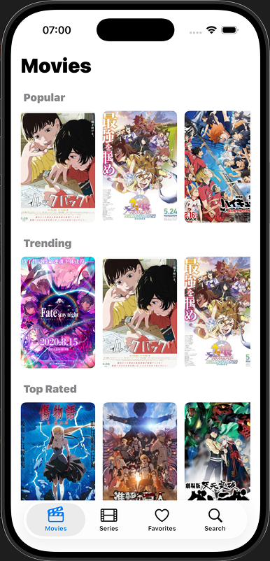

# Jutsu App

**Jutsu** is an iOS application for browsing anime.  
The app allows users to view a list of anime titles, search for anime, open detailed information, and add anime to favorites.

The project is written in **Swift** using **UIKit** and is built with **Xcode**.

---

## Main Screen 



> Screenshot of the main catalog screen.

---

## Features
- Browse anime list
- Search anime by title
- View anime details
- Add anime to favorites
- View favorite anime
- Play anime

---

## Installation
### 1. Clone the Project

```bash
git clone https://github.com/rturumov/JutsuApp.git
```

### 2. Run the Application

### Requirements
- macOS
- Xcode
- iOS Simulator or a physical iPhone

### How to Run
1. Open the project in Xcode:
2. Change bundle identifier and team.
3. Choose an iPhone Simulator (for example, iPhone 16 or iPhone 17).
4.	Press the Run (▶) button to build and launch the app.

## Authors

- 22B030603 Rassul Turumov
- 22B030428 Aldiyar Sadykov 